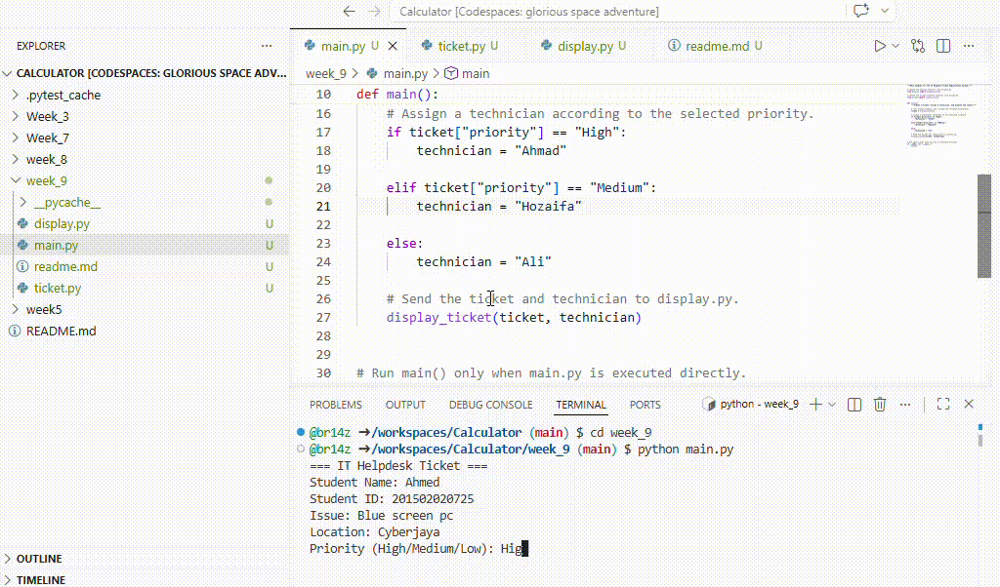

# IT Helpdesk Ticket Registration System

## Project Description

This project is a simple IT Helpdesk Ticket Registration System developed using Python. It allows a student to report a technical problem by entering their name, student ID, issue, location, and priority level.

The system automatically assigns a technician according to the selected priority:

- High priority → Ahmad
- Medium priority → Siti
- Low priority → Ali

After collecting the information, the system displays the completed ticket with a default status of **Pending**.

## Project Objectives

The objectives of this project are:

- To practise modular programming in Python.
- To separate the program into different files.
- To collect and store user input.
- To use conditional statements for technician assignment.
- To display ticket information clearly.

## File Descriptions

### `main.py`

This is the main program file. It controls the ticket-registration process, checks the priority and assigns the correct technician.

### `ticket.py`

This module collects the ticket information from the user. It also validates the priority to ensure the user enters High, Medium or Low.

### `display.py`

This module displays the completed helpdesk ticket, including the student’s details, issue, assigned technician and status.

## How the System Works

1. The user runs `main.py`.
2. The program asks for the ticket information.
3. The user selects a priority level.
4. The system assigns a technician.
5. The completed ticket is displayed.
6. The ticket status starts as **Pending**.

## How to Run the Program

Open the terminal inside the project folder and enter:
```bash
python main.py